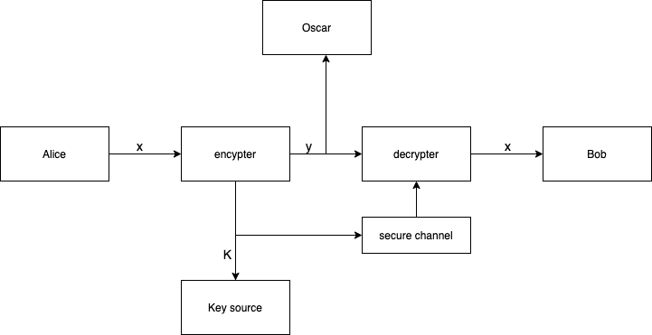

## Cryptography

### Referrence 
- Handbook: [Applied Crytography](http://cacr.uwaterloo.ca/hac/)
- Apply: [Practical cryptography for developer](https://cryptobook.nakov.com/)

### What is cryptography
- Cryptography is the science of using mathematics to encrypt and decrypt data.
- Cryptography enable people to store sensitive information/data or transmit it across insecure networks so that
no one can read it except the intended recipient.
  
### Hash function


### Basic formula
- Encryption rule: e
- Decryption rule: d
- Encryption key: k1
- Decryption key: k2
- Message space:
```
                       dk2(ek1(x)) = x
```

- One-to-one function: One plaintext with the key will encrypt to one ciphertext then one 
ciphertext with the key will decrypt to one plaintext.

### Communication channel


- Secure channel:

### Cryptosystem
A cryptosystem is a five-tuple (P, C, K, E, D), where:
- P is finite set f possible plaintext
- C is a finite set of possible ciphertexts
- K, the keyspace, set of possible keys


### Classical cipher 
#### The shift cipher: Key space
To be secure: should be very large
To improve the Shift Cipher 

#### The substitution cipher
Let P = C = Z(26) \
We have 26 factorial case when apply substitution cipher

#### Affine cipher
1. Definition: 
The Affine cipher is a type of monoalphabetic substitution cipher, wherein each letter in an alphabet is mapped to its numeric equivalent, encrypted using a simple mathematical function, and converted back to a letter.

2. Formula:
- Encryption

```
                         E ( x ) = ( a x + b ) mod m 
                        modulus m: size of the alphabet
                        a and b: key of the cipher.
                        a must be chosen such that a and m are coprime.
```
- Decryption:
```
                        D ( x ) = a^-1 ( x - b ) mod m
                        a^-1 : modular multiplicative inverse of a modulo m. i.e., it satisfies the equation
                        1 = a a^-1 mod m .
```

** Referrence: https://www.geeksforgeeks.org/implementation-affine-cipher/

#### Vigenere cipher

** Polyalphabetic:
- We apply encyption for a block content not for each elements. It means block of characters to block of charaters.
- A polyalphabetic cipher is any cipher based on substitution, using multiple substitution alphabets. The Vigenère cipher is probably the best-known example of a polyalphabetic cipher, though it is a simplified special case.


#### Hill cipher
1. Basic linear algebra
    - Identity matrix: a square matrix with 1's 
    - Inverse matrix:
        - Not all matrices have inverse but if it is exists, it is unique
        - If the determinant of the matrix A (detA) is not zero, then this matrix has inverse. 
        - A matrix A has inverse modulo 26 iff gcd(detA, 260) = 1 
** Referrence: https://www.geeksforgeeks.org/vigenere-cipher/

#### General Assumption
- Kerchkhoffs' Principle: 

- Attack models:
    - Ciphertext only attack: Oscar possesses a string of ciphertext y
    - Known plaintext attack:  Oscar possesses a string of plaintext x and the corresponsding ciphertext y
    - Chosen plaintext attack: Oscar can temporarily use the encryption rule
    - Chosen ciphertext attack: Oscar can temporarily use the encryption rule
    ->>> Objective: determine the key

#### Congruence
a,b are integer; m is a positive integer a === b (mod m), called a congruence, if (a-b) 
divides m.


